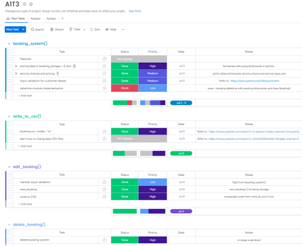
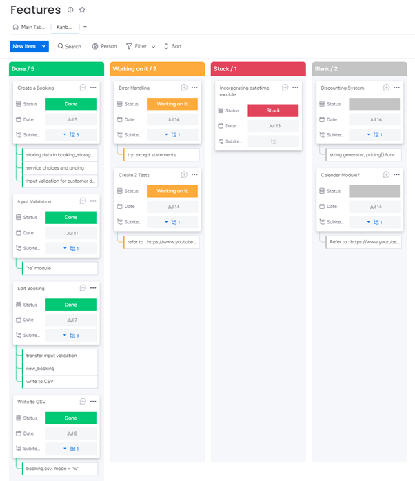
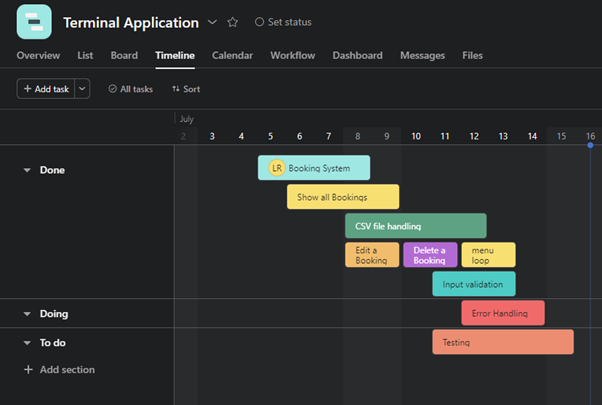

# Documentation: Rico’s Media and Marketing Service 
### [Link to Video Overview](https://youtu.be/zdnLXSXNm_0) 
### [Link to Repository](https://github.com/ForestRico/-LaurenceRico-_T1A3.git)
## __Introduction__
Rico’s Media and Marketing Service is a program that enables users to book and schedule their media and marketing services. The program was created using the programming language Python and was packaged together into a standalone executable by PyInstaller. This program should be able to run on all Windows Operating Systems as PyInstaller packages the code with the required Python interpreter and standard library modules. To utilise this program, it is as simple as running the booking_app.exe file within this repository. (\GitHub\-LaurenceRico-_T1A3\dist\booking_app.exe). 
## __Dependencies:__
There are no dependencies that this program requires. This program utilises the CSV File Handling Module and RE Module which are standard libraries that come preinstalled with Python. 
## __Features of this Program:__ 
This program/application is a booking system for media and marketing services and offers the following features:
- Creates a Booking: This core feature enables users to enter their personal details, including name, phone number, date, time, and service choices.
- Implements Input Validations: The program validates user input to ensure its accuracy and conformity with the required format and data types.
- Stores User Information: All created bookings are stored in a CSV file named "bookings.csv." This allows for permanent storage of bookings, facilitating access through functions such as "Find Booking Details," "Edit a Booking," and "Show all Bookings."
- Provides Error Handling: The program identifies invalid inputs and prompts users to enter valid information.
- Displays all Bookings: This function prints out all the bookings stored in the "bookings.csv" file. It is executed before the "Edit a Booking" and "Delete a Booking" functions, enabling users to review the existing bookings.
- Allows Booking Editing: Users can modify an existing booking by selecting the corresponding booking number and entering updated details.
- Supports Booking Deletion: Users can delete a booking by selecting the booking number associated with the desired booking.
## __Features in Detail:__

### __Storing User Input Data__

The program includes a function called `write_to_csv()` that is responsible for storing user information. This function utilizes the CSV module and file operations to write the input data into a CSV file. It opens the "bookings.csv" file in write mode, overwriting any existing data. The column names for the CSV file are extracted from the keys of the attributes initially stored in the `booking_storage` dictionary. The function uses the `DictWriter` class to write the data in dictionary format. The `writerheader()` function writes the header names (column names) of the CSV file. It then iterates over the values in the `booking_storage` dictionary, which are instances of the `Booking` class, and writes each object's attributes as a new row in the CSV file using the `writerow()` method of the `DictWriter` object.

```python
def write_to_csv():
    with open('bookings.csv', mode='w') as csvfile:
        fieldnames = booking_storage[list(booking_storage.keys())[0]].__dict__.keys()
        writer = csv.DictWriter(csvfile, fieldnames = fieldnames)
        writer.writeheader()
        for row in booking_storage.values():
            writer.writerow(row.__dict__)
```

### __Input Validation__ 

```python
 while True:
        customer_phone = input("Please enter your phone number: ")
        if re.match(r'^\d{10}$', customer_phone):
            break
        else:
            print("Invalid phone number format! Please enter a 10-digit number.")
```

- The ‘re’ (regular expression) module is utilised to ensure user input patches the specific set pattern based on the prompt. 
- The re.match() function sets this pattern using complex syntax.
- ‘^’ determines the start of the string.
- ‘\d’ sets the integer input valid to (0-9)
- ‘{10}’ sets the length of digits (10).
- ‘$’ determines the end of the string.
- These rules ensure that ‘customer_phone’ consist of 10 digits 

```python
 while True:
        time = input("Please enter the time (HH:MM): ")
        if re.match(r'^\d{2}:\d{2}$', time):
            break
        else:
            print("Invalid time format! Please enter a valid time in the format HH:MM.")
```

- ‘^’ start of the string
- ‘\d’ sets the integer range (0-9)
- ‘{2}’ specifies that 2 digits should be matched
- ‘:’ matches a colon
- ‘$’ end of string
- These rules ensure that ‘time’ follows the formart HH:MM 

### __Error Handling__ 

```python
def booking_menu():
    while True:
        print("\nWelcome to Rico's Media & Marketing Services!\n1. Create a Booking\n2. Find your Booking Details\n3. Show all Bookings\n4. Edit a Booking\n5. Delete a Booking\n6. Exit")
        choice = input("\nEnter a choice (1-5): ")
        if choice == "1":
            create_booking()
            write_to_csv()
            if not end_menu():
                return False        
    
        elif choice == "2":
            find_booking()
            if not end_menu():
                return False

        elif choice == "3":
            show_booking_list()
            if not end_menu():
                return False
```

Utilising the ‘re’ (regular expression) module, if statements and while loops are the predominant mechanisms that handle and prevent errors in my program. 
If statements allow the program to check if a condition is fulfilled in order to process the next steps, otherwise if conditions aren’t met the program will prompt a message to enter the correct input. This way the program will only proceed unless the input provided by the user is valid. 

While loops allow the program to repeatedly execute a function until the condition returns False. This was greatly useful for my booking_menu() and end_menu() functions, which requires to be iterated throughout my program. 

- Overall, the program implements storing user information in a CSV file, validates user input using regular expressions, and includes error handling mechanisms to ensure smooth execution.


### __My Implementation Planning (Project Management)__



